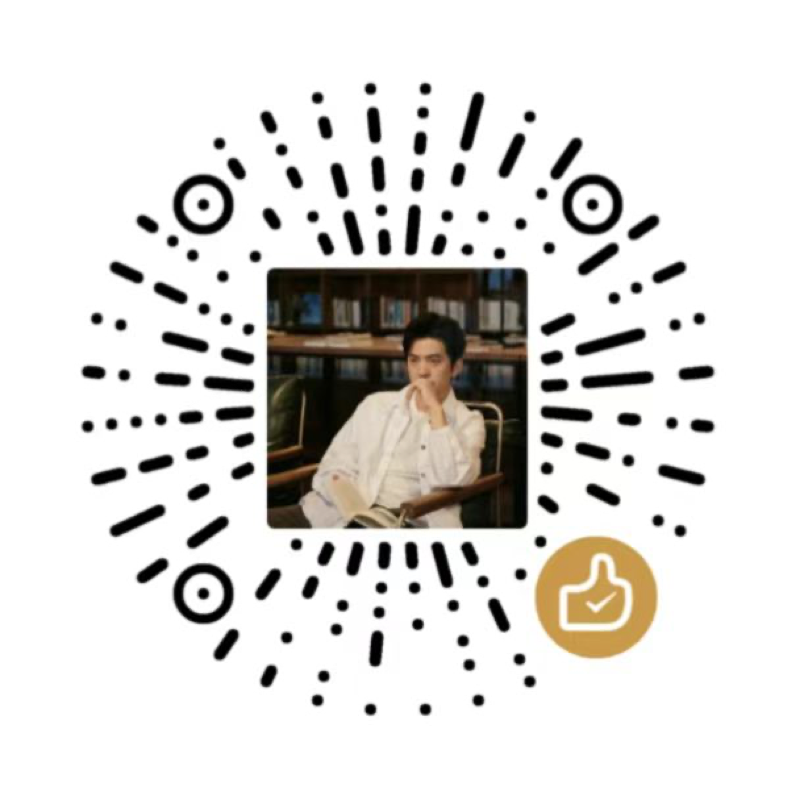

<div align="center">

# AI 命运工具公开测评

<p align="center">
  
</p>

> *12 款开源命理工具、16 种配置、24 个普通人的 46 件人生大事：工具组第一名，没有超过「四句好话」对照。*


[](https://github.com/read2017/ai-divination-benchmark/stargazers)

<br>

**藏起 24 个普通人的真实经历，只给出生资料和一段三年窗口，让 12 款开源命理工具自己判断事业、感情、学业、钱财会怎么变，再逐条对照公开记录。原始回答、评分规则、对照组和全部方法边界都在仓库里，评分不联网即可复算。**

<sub>八字 · 紫微斗数 · 印度占星 · 奇门 · 六爻 · 塔罗 ｜ 中文 ｜ 同一模型 gpt-6-luna</sub>

<br>

[从哪里开始](#从哪里开始) · [完整成绩](#完整成绩) · [怎么测](#怎么测) · [复核成绩](#复核成绩) · [必须一起看的边界](#必须一起看的边界) · [目录与授权](#目录与授权) · [展示网页](docs/index.html)

<br>

</div>

---

这是一份探索性回测，不是未来准确率证明。24个普通人的公开案例、46件选定人生大事；统一使用 `gpt-6-luna` 解读。覆盖八字、紫微斗数、印度占星，以及模拟奇门、六爻、塔罗。本仓库发布测评结果、评分方法和已有回答，不提供付费占卜服务。

## 从哪里开始

- [通俗测评报告](reports/publication/人生变化命理测评-v6.md)：完整榜单、GitHub原链接及事业／感情／学业／钱财分项。
- [录屏展示网页](docs/index.html)：下载仓库后用浏览器打开；F全屏、R简洁模式、上下方向键切换章节。GitHub文件页只显示源代码，在线展示可手动配置Pages，见[发布说明](PUBLICATION.md)。
- [证据附件](reports/publication/人生变化命理测评-v6-证据附件.md)和[逐题明细CSV](reports/publication/人生变化测评-逐题明细.csv)。
- 口播稿与自媒体成稿留在本地，不随仓库发布；本仓库只放可复核的测评材料。

## 完整成绩

**出生资料组**：隐藏姓名与经历，只给出生资料和一段三年窗口。12 个配置，按准确分排序：

| # | 项目 | 体系 | 准确分 /85 | 最终分 /100 | 大事对上 /46 | 方向说对 /37 | 说反 | 作答 |
|---:|---|---|---:|---:|---:|---:|---:|---:|
| 1 | [雪眠八字](https://github.com/xuemian168/bazi-skill) | 八字 BaZi | 10.61 | 16.74 | 4 | 8 | 4 | 24/24 |
| 2 | [金辰八字](https://github.com/jinchenma94/bazi-skill) | 八字 BaZi | 9.94 | 16.00 | 4 | 6 | 5 | 24/24 |
| 3 | [命理大师](https://github.com/learnwithu/mingli-master) | 紫微 Zi Wei | 6.36 | 11.69 | 2 | 8 | 5 | 24/24 |
| 4 | [印度占星](https://github.com/CNWU16/vedic-astro-skills) | 吠陀占星 Vedic | 5.31 | 7.57 | 0 | 6 | 1 | 10/24 |
| 5 | [Wolke 紫微](https://github.com/Wolke/ziwei-doushu) | 紫微 Zi Wei | 4.58 | 8.42 | 0 | 9 | 2 | 24/24 |
| 6 | [太卜·紫微](https://github.com/hhszzzz/taibu) | 紫微 Zi Wei | 4.29 | 9.11 | 1 | 6 | 1 | 24/24 |
| 7 | [八字＋紫微](https://github.com/AdrianBOM/bazi-ziwei-skill) | 八字＋紫微 | 2.36 | 5.65 | 0 | 5 | 1 | 24/24 |
| 8 | [命语](https://github.com/Brhiza/mingyu) | 八字 BaZi | 1.25 | 4.88 | 0 | 4 | 7 | 22/24 |
| 9 | [高鑫八字](https://github.com/gaoxin492/bazi-skill) | 八字 BaZi | 0.21 | 1.96 | 0 | 1 | 2 | 10/24 |
| 10 | [Horosa](https://github.com/Horace-Maxwell/horosa-skill) | 八字 BaZi | 0.21 | 1.79 | 0 | 1 | 2 | 9/24 |
| 11 | [Suangua](https://github.com/Sudo-Biao/suangua) | 八字 BaZi | 0.00 | 0.00 | 0 | 0 | 0 | 0/24 |
| 12 | [太卜·八字](https://github.com/hhszzzz/taibu) | 八字 BaZi | 0.00 | 0.00 | 0 | 0 | 0 | 0/24 |

**问事组**：给定时刻或随机条件下的模拟咨询，与出生资料组口径不同，单独列榜。4 个配置：

| # | 项目 | 体系 | 准确分 /85 | 最终分 /100 | 大事对上 /46 | 方向说对 /37 | 说反 | 作答 |
|---:|---|---|---:|---:|---:|---:|---:|---:|
| 1 | [太卜·奇门](https://github.com/hhszzzz/taibu) | 奇门遁甲 Qi Men | 4.57 | 9.70 | 3 | 3 | 1 | 24/24 |
| 2 | [太卜·六爻](https://github.com/hhszzzz/taibu) | 六爻 Liu Yao | 1.04 | 5.08 | 0 | 1 | 0 | 23/24 |
| 3 | [太卜·塔罗](https://github.com/hhszzzz/taibu) | 塔罗 Tarot | 0.73 | 2.95 | 1 | 0 | 1 | 11/24 |
| 4 | [Daman 塔罗](https://github.com/daman-ovo-0404/tarot-skill) | 塔罗 Tarot | 0.10 | 1.48 | 0 | 1 | 1 | 10/24 |

**不用命理工具的对照**（不是被测项目）：

| 对照 | 准确分 /85 | 最终分 /100 | 大事对上 /46 | 方向说对 /37 | 说反 | 作答 |
|---|---:|---:|---:|---:|---:|---:|
| 全说好事 —— 固定四句话 | 32.05 | 40.26 | 19 | 18 | 9 | 24/24 |
| 普通 AI —— 不加载任何 Skill | 0.00 | 0.00 | 0 | 0 | 0 | 0/24 |

「全说好事」的四句原话是：**会找到新工作／会开始恋爱／会进入新的学习阶段／钱会增加**。另有**错生日对照**（把出生资料换成另一个人的），用于检验回答是否真的跟着输入走，只做到 5 个婚恋案例，样本太小，不外推。

怎么读这几张表：

- **准确分 /85** 只算对得上公开记录的部分（大事命中＋方向正确＋时间接近）；**最终分 /100** 另含具体性、错输入对照与可观察易用性。排名按准确分。
- **大事对上 /46**：46 件待验证大事里，说得与公开记录相符的件数。**方向说对 /37**：事业／感情／学业／钱财四类中方向判断正确的次数；**方向说反**单独计罚。
- 类别命中不等于年份完全准确；未命中不全是猜错，也包括遗漏和未作答。**普通 AI 对照没有给出任何判断**，它的零分不能用来反证命理工具有效。
- 链接指向本轮实际读取的仓库，列出来**不等于推荐，也没有合作关系**。未覆盖手相、风水、合婚，以及六爻、奇门的真实问事预测（本轮问事组只做模拟咨询）。

## 怎么测

隐藏姓名与经历，给出生资料及三年窗口；结果交出后对照公开来源。评分关注事情、方向、时间、套话、错输入和交付体验。问事组使用固定时刻／随机条件模拟咨询，单独列榜。

- [冻结评分规则](runs/v6-consumer-events/protocol.md)
- [预测指令](runs/v6-consumer-events/predictor-instructions.md)
- [原始回答](runs/v6-consumer-events/answers/)、[错输入对照](runs/v6-consumer-events/controls/)、[体验探针](runs/v6-consumer-events/probes/)
- [24题来源与目标](datasets/gold/v6-events.jsonl)、[输入](runs/v6-consumer-events/inputs/)
- [实际项目版本](runs/v6-consumer-events/metadata/source-versions.json)、[文字资格裁定](runs/v6-consumer-events/adjudications.json)
- [机器成绩](reports/v6-consumer-scores.json)

## 复核成绩

只需要Python 3.10或以上，评分不联网，不需要API密钥，也不需要安装被测Skill。

```bash
python3 scripts/verify_release.py
python3 scripts/reproduce_scores.py
```

第二条在临时目录复算，不覆盖已发布成绩，比较完整JSON与逐题CSV。此处可复现的是“给定原答的评分”，不是重新生成模型回答：没有附一键调用模型、安装所有排盘依赖的运行器。大型原生排盘文件、依赖和下载的第三方仓库留在本地；相应模式限制与纠错记录见证据附件。

## 必须一起看的边界

- 公开来源包含网站口述整理、作者命例转述和论坛自述，未独立核实；部分出生盘可能按经历校时。
- 三年窗口按已知事件与领域覆盖选择，不能估算一般人群未来预测能力。
- 隔离依赖指令，不是权限强制双盲；模型训练记忆风险无法排除。一次问事预测曾误查旧报告，已作废并重新生成，见证据附件。
- 全部是“Skill＋同一个Luna模型”的组合表现；换模型可能换名次。
- 错输入仅5个婚恋案例；易用性无真人满意度调查；文字裁定无独立人工评审。
- 出生资料用匿名编号，但出生时间和来源仍可关联原公开案例，不应把它们称为彻底匿名数据，禁止尝试重新识别当事人。

## 目录与授权

`docs/` 展示网页；`reports/` 最新报告及成绩；`datasets/` 选定目标；`runs/` v6回答与规则；`harness/` 原始评分程序；`scripts/` 复核入口；`provenance/` 公开文件散列。

本仓库没有为作者原创内容擅自设置开源授权。公开可读不等于任意再授权；第三方图片及案例材料的权利归原作者，详见[第三方声明](THIRD_PARTY_NOTICES.md)。

## 关于作者

这份测评和配套的口播内容发在「**沉思哲｜AI产品研发**」。

<table>
<tr>
<td align="center"><br/><sub>抖音 · 108799524</sub></td>
<td align="center"><br/><sub>小红书 · 26262268555</sub></td>
<td align="center"><br/><sub>微信赞赏码</sub></td>
</tr>
</table>

邮箱：read2016@qq.com ｜ 如果这份测评帮你省了时间，可以扫码请我喝一杯 ☕

## 支持这个项目

如果这份测评对你有用，**[点个 Star](https://github.com/read2017/ai-divination-benchmark/stargazers) 让我知道这类实测值得继续做**；[点 Watch](https://github.com/read2017/ai-divination-benchmark/subscription) 会在有更新时收到通知。
